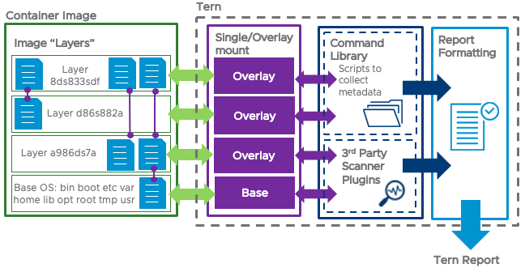

# What is Tern

Tern is a VMware-originated open source project that gathers metadata for the packages installed in a container and produces a Software Bill of Materials for that image. This Software Bill of Materials, also known as an SBoM, is primarily designed to help developers and product teams better meet open source license obligations for their containers. It could also be used to improve the security and quality posture of their container builds and provides transparency to their container software supply chain.

## How Tern Works

The following diagram is a visual depiction of Tern's inner workings.



Given a container image, Tern will mount the filesystem layers and utilize the command library’s collection of scripts to gather information about the software packages installed in each layer. For a more detailed inspection of a container image, Tern can also expose the container layers to third party file analyzers and incorporate the information that these analyzers collect into the SBoM. Tern can generate SBoMs in different standard formats, which allows for greater interoperability between other compliance and security tooling.

## Prerequisites

### Step 1: Install environment dependencies.

```
$ sudo apt install python3 python3-pip attr git jq openjdk-8-jdk-headless maven
```

## Installing Tern

### Step 1: Ensure required dependencies are available.

```
$ pip3 install wheel
```

### Step 2: Install Tern from PyPI.

```
$ pip3 install tern
```

Tern is now ready to be used to inspect Docker container images. To see a preview of Tern's capabilities, run `tern -h` and `tern report -h`.


